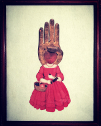
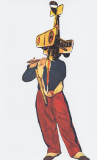
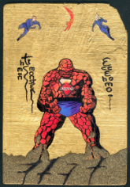
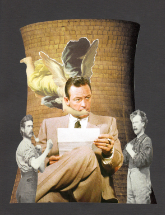
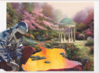



## *Works*

I am a therapist, writer, poet, pastor, and artist; regarding the latter, my medium is collage, which explains how I can
piece all these parts together to make a life. I work with pictures, paragraphs, and people. Track [tags](http://www.imby.net/tags.html) to drill down; or travel through time below.

&nbsp;

<table cellpadding='5'>
  <tr>
    <td width='175' valign='top'>
      <h2>f e a t u r e d</h2>
      
<a href='https://cottonbureau.com/people/maddalena-collage'>Collage Art on T-Shirts</a>

      

     
<strong>View</strong> <a href='https://www.dpmaddalena.com/20140223/collected-collages'>collected collages</a> going back 15+ years. Like your collage with more action? <a href='audio-video.html'>Video collages</a> and <a href='audio-video.html'>audio collages</a> do not sit still.

         
<strong>Read </strong><a href='poetry.html'>poetry</a>.

     
<small>Haiku for every 
     star and grain of sand passing 
     between a child's hands</small>

     
<strong>Read</strong> <a href='20220116/Echoes-of-a-Future-Truth'>selections</a> from my fiction project, <em>Echoes of a Future Truth</em>

      

      
<strong><a href="https://vsco.co/maddalena/gallery">Earthprints</a></strong>: nature breaks through

      
<strong>Father/daughter</strong> rep-art-ee: <strong><a href="http://daveartzoe.wordpress.com/">Dave Art Zoe</a></strong>

      

      
My <strong><a href="http://maddalenamft.com">Counseling psychotherapy</a></strong> practice

       

      

      

      

     
    
    </td>
    <td>
      <h2>&nbsp; &nbsp; &nbsp; p o s t s</h2> 

      <ul class="posts">
     
     <li>{{ post.date | date_to_string }} &raquo; <a href="{{ BASE_PATH }}{{ post.url }}">{{ post.title }}</a></li>
     
      </ul>
    </td>
  </tr>
 </table>

